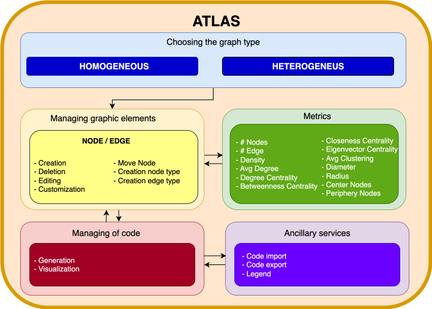
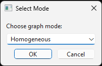
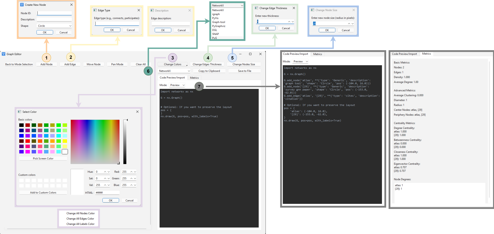
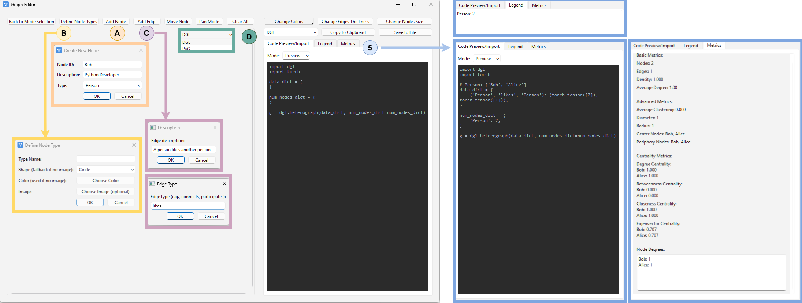
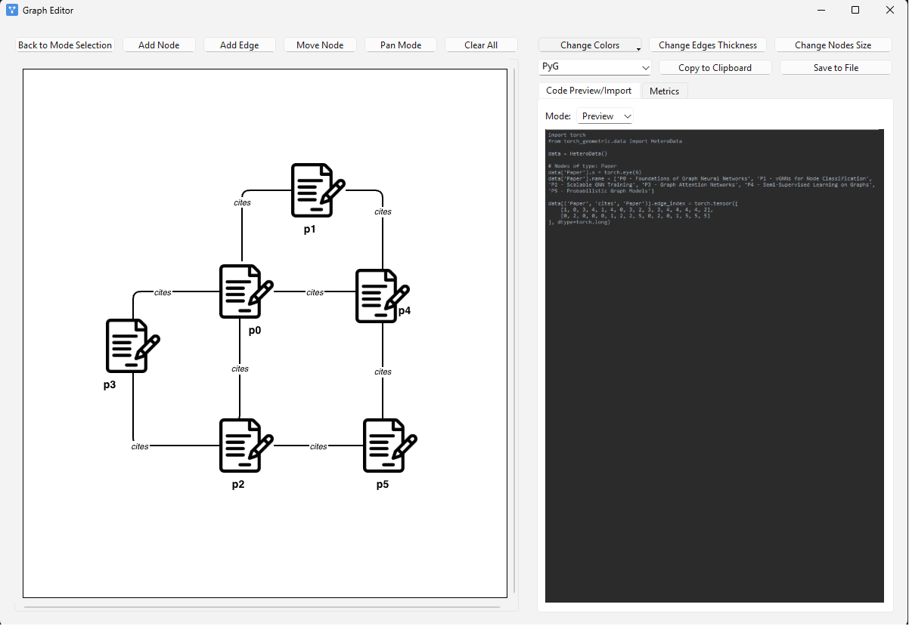
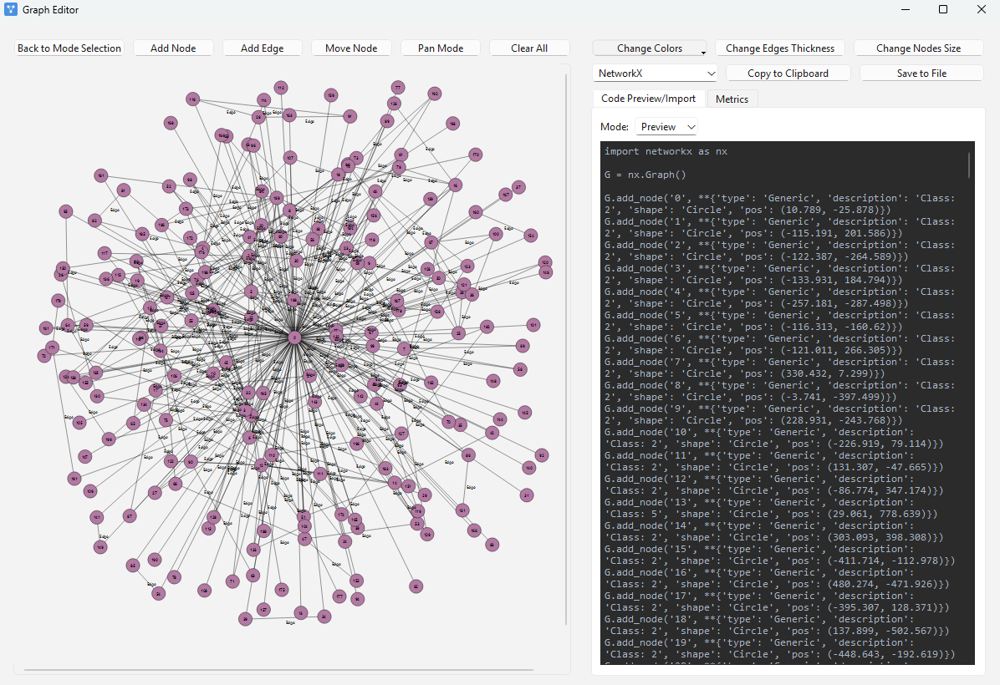
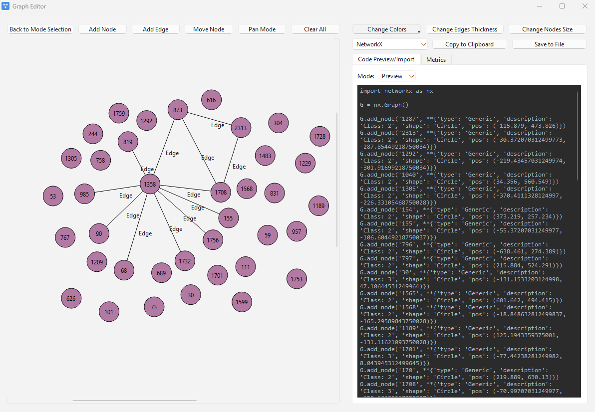
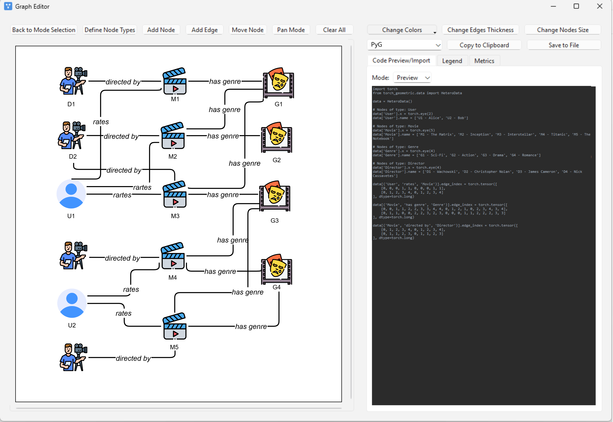
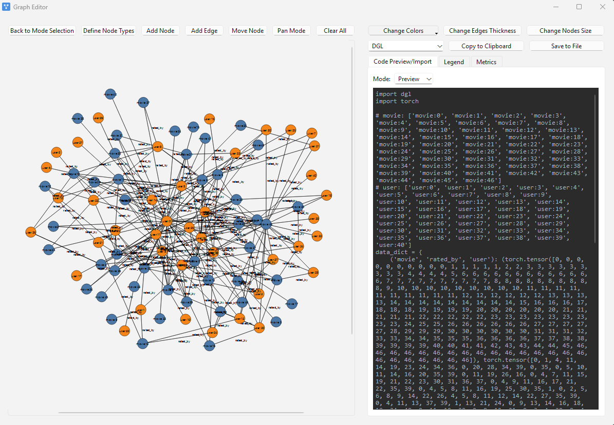
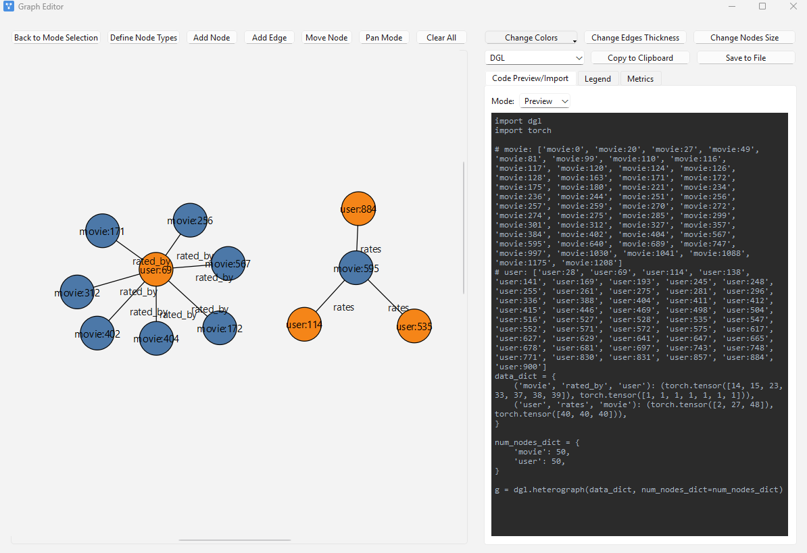

<h1 align="center">ATLAS: A Software for Interactive Modeling and Analysis of Homogeneous and Heterogeneous Graphs</h1>

<p align="center">
    
</p>

ATLAS is an interactive software framework for constructing, analysing, and visualizing homogeneous and heterogeneous graphs.

The framework bridges visual graph modelling with modern graph analytics and graph-learning workflows. Through an intuitive graphical interface, users can create and customize graph structures, inspect structural properties in real time, and automatically generate executable Python code compatible with major graph libraries, including NetworkX, igraph, PyVis, DGL, and PyTorch Geometric.

ATLAS also supports the import of existing graph code, enabling a bidirectional workflow between visual graph design and programmatic graph manipulation. Furthermore, the framework provides tools for visualizing graph-based explanations generated by Graph Neural Networks (GNNs), facilitating the inspection and interpretation of graph learning models.

The software supports both homogeneous and heterogeneous graph scenarios and is demonstrated through real-world case studies involving citation networks and recommendation systems.

---

## Table of Contents

- [Features](#features)
- [Environment Setup](#environment-setup)
- [Launching ATLAS](#launching-atlas)
- [Software Description](#software-description)
  - [Homogeneous Graphs](#homogeneous-graphs)
  - [Heterogeneous Graphs](#heterogeneous-graphs)

---

# Features

ATLAS provides an integrated environment for graph modelling, analysis, and machine learning workflow integration.

Main features include:

- Interactive construction of homogeneous and heterogeneous graphs.
- Custom definition of node and edge attributes.
- Support for multiple node visualization styles, including shapes, colors, and custom icons.
- Real-time computation of structural graph statistics.
- Automatic generation of executable Python code.
- Export support for major graph libraries:
  - NetworkX
  - igraph
  - PyVis
  - DGL
  - PyTorch Geometric
- Import of existing Python graph definitions.
- Visualization of graph datasets and GNN-generated explanations.
- Integration with graph learning pipelines for training and explanation analysis.

---

# Environment Setup

ATLAS targets **Python 3.12** and uses [uv](https://github.com/astral-sh/uv) for dependency management.

After cloning the repository, install all dependencies with:

```bash
uv sync
````

The project dependencies can be divided into two groups according to their purpose.

## GUI and Graph Visualization

These dependencies are required to run the ATLAS graphical interface and provide graph visualization, configuration management, and data processing functionalities.

| Package       | Purpose                                                    |
| ------------- | ---------------------------------------------------------- |
| `click`       | Command-line interface utilities.                          |
| `jupyter`     | Interactive notebooks for development and experimentation. |
| `networkx`    | Graph representation and structural analysis.              |
| `pandas`      | Tabular data manipulation.                                 |
| `pyqt6`       | Graphical user interface framework.                        |
| `ruamel-yaml` | YAML configuration file management.                        |
| `scipy`       | Scientific computing utilities.                            |

## GNN Training and Explanation

These dependencies are required to reproduce the graph learning experiments and generate graph explanations.

| Package           | Purpose                                                                         |
| ----------------- | ------------------------------------------------------------------------------- |
| `torch`           | Deep learning framework used for GNN training.                                  |
| `torch-geometric` | Graph learning framework providing datasets, models, and explanation utilities. |
| `torchmetrics`    | Metrics computation during training and evaluation.                             |
| `transformers`    | Transformer-based models used by multimodal components.                         |

All dependencies are installed automatically through `uv sync`.

Users interested only in the graph visualization interface can use ATLAS without running the machine learning experiments. Conversely, reproducing the presented case studies requires the complete environment.

---

# Launching ATLAS

After installing the dependencies, the graphical interface can be started with:

```bash
uv run main.py
```

The first window allows users to select the graph type to model:

<p align="center">
    
</p>

The user can choose between:

* **Homogeneous graphs**, where all nodes and edges share the same semantic type.
* **Heterogeneous graphs**, where multiple node and edge types can coexist.

---

# Software Description

## Homogeneous Graphs

<p align="center">
    
</p>

ATLAS provides a complete workflow for interactively constructing and analysing homogeneous graphs.

The graph editor includes tools for creating nodes and edges, modifying graph attributes, and navigating the visualization canvas.

### Node Creation and Customization

Nodes can be added directly to the canvas using the **Add Node** function.

Each node is associated with:

* A unique identifier.
* A textual label.
* Visual attributes such as:

  * Shape.
  * Color.
  * Size.

Nodes can be freely repositioned through drag-and-drop operations.

### Edge Creation

Edges can be created by connecting pairs of nodes through the **Add Edge** function.

Each edge can include additional information, such as:

* Relation type.
* Description.
* Directionality.

Existing edges can be modified or removed directly from the interface.

### Visual Customization

ATLAS provides dedicated panels for controlling the visual representation of graph elements.

Users can customize:

* Node appearance.
* Edge style.
* Label visualization.
* Graph layout properties.

All changes are immediately reflected in the canvas.

### Backend Selection and Code Generation

ATLAS supports exporting graphs to multiple graph-processing frameworks.

Available backends include:

* NetworkX.
* igraph.
* PyVis.
* DGL.
* PyTorch Geometric.

The **Code Preview** panel automatically generates executable Python code corresponding to the current graph state.

The generated code can be:

* Copied directly.
* Exported as a standalone Python script.
* Integrated into external graph analysis or machine learning workflows.

### Real-Time Graph Metrics

During graph construction, ATLAS continuously computes structural graph statistics, including:

* Number of nodes.
* Number of edges.
* Graph density.
* Average degree.
* Additional structural indicators.

This enables users to analyse graph properties while designing the structure.

---

## Heterogeneous Graphs

<p align="center">
    
</p>

ATLAS also supports heterogeneous graphs, where multiple node and edge types coexist.

This functionality enables the representation of complex relational scenarios, such as recommendation systems, knowledge graphs, and multi-domain networks.

### Node Types

Unlike homogeneous graphs, each node is associated with a semantic type.

Node types can be configured through the dedicated management panel by specifying:

* Type name.
* Shape.
* Color.
* Optional custom icon.

Custom images can replace the default geometric representation, improving readability for domain-specific applications.

### Typed Nodes and Relations

Each node stores:

* A unique identifier.
* A label or description.
* Internal metadata.
* Its associated node type.

Edges represent typed semantic relations between nodes and preserve their source and destination categories.

### Backend Selection

ATLAS supports exporting heterogeneous graphs to:

* DGL.
* PyTorch Geometric.

The generated code automatically adapts to the selected framework:

* **DGL** represents relations using canonical edge types:

```text
(source_type, relation_type, destination_type)
```

* **PyTorch Geometric** exports heterogeneous graphs using the `HeteroData` representation.

### Code Generation and Import

The Code Preview panel keeps the graphical representation synchronized with the generated Python implementation.

Any modification applied to the graph is automatically reflected in the exported code.

### Legend and Metrics

The integrated legend panel summarizes all node types and their visual representations, including:

* Shape.
* Color.
* Associated icon.

The metrics panel provides real-time structural information about the heterogeneous graph during construction and exploration.


# Case Studies

The following case studies demonstrate how ATLAS can be used to model real-world graph structures, generate executable graph representations, and visualize graph learning outputs.

The first case study focuses on the **Cora citation network**, representing a homogeneous graph scenario. The second case study considers the **MovieLens recommendation system**, which naturally fits the heterogeneous graph setting.

In addition to interactive graph construction, both examples show how ATLAS can be integrated with graph machine learning pipelines to visualize datasets and GNN explanations.

---

# Case Study — Cora Citation Network

The Cora dataset is a widely adopted benchmark in graph machine learning. It represents a citation network where:

- Nodes correspond to scientific publications.
- Directed edges represent citation relationships.
- Each publication belongs to one of seven research topics.

Since all nodes represent the same entity type and all edges describe the same relation type, Cora naturally corresponds to a homogeneous graph.

## Interactive Graph Construction

The workflow starts by selecting the **Homogeneous Graph** mode in ATLAS.

A representative citation subgraph can then be created interactively by adding paper nodes to the canvas and connecting them through directed citation edges.

<p align="center">
    
</p>

The resulting graph preserves the topology of the citation network while providing an interpretable visual representation.

---

## Exporting the Graph Representation

Once the graph has been created, ATLAS automatically generates executable Python code corresponding to the current graph structure.

By selecting **PyTorch Geometric** as the target backend, the generated implementation is compatible with graph deep learning pipelines.

The exported script:

- Instantiates the graph structure.
- Defines node feature placeholders.
- Encodes graph connectivity through the `edge_index` representation.
- Maps graph entities to integer identifiers.
- Produces executable PyTorch Geometric code.

The generated code can be:

- Copied directly from the interface.
- Exported as a standalone Python file.
- Integrated into external graph learning workflows.

---

## Dataset Visualization

ATLAS can also be used to visualize complete graph datasets.

To generate the Python code required to reconstruct the Cora dataset, execute:

```bash
uv run script_exe.py dataset_code \
    --parameters configs/dataset_download/planetoid.yaml
````

The generated script:

```text
dataset_code/planetoid/graph_export.py
```

can be imported directly into ATLAS through the code import functionality.

The resulting visualization is shown below:

<p align="center">
    
</p>

This workflow enables users to move seamlessly between existing graph datasets and interactive visual analysis.

---

## GNN Training and Explanation Visualization

ATLAS also supports the visualization of graph explanations generated by Graph Neural Networks.

For this case study, we train a Graph Attention Network (GAT) for node classification and compute explanations using **GNNExplainer**.

The complete workflow consists of:

1. Training the GNN model.
2. Computing the explanation for a target node.
3. Extracting executable visualization code.
4. Importing the explanation graph into ATLAS.

### Training the GNN

The model can be trained by executing:

```bash
uv run script_exe.py training \
    --parameters configs/training/planetoid.yaml \
    --cls PlanetoidRun
```

### Computing Explanations

After training, explanations can be generated using:

```bash
uv run script_exe.py explain \
    --parameters configs/explain/planetoid.yaml \
    --cls PlanetoidExplainerRun
```

The explanation procedure identifies the most relevant nodes and edges contributing to the prediction of the target node.

### Exporting Explanation Visualization Code

The visualization code for the explanatory subgraph can be generated with:

```bash
uv run script_exe.py dataset_code \
    --parameters configs/explanation_code/planetoid.yaml \
    --explanation
```

The generated script:

```text
dataset_code/planetoid/explanation_export.py
```

can be imported into ATLAS to visualize the explanation.

<p align="center">
    
</p>

This example demonstrates how ATLAS connects interactive graph visualization with explainable graph learning workflows, enabling users to inspect the structural evidence supporting GNN predictions.

---

# Case Study — MovieLens Recommendation System

The MovieLens dataset represents a heterogeneous recommendation scenario where multiple entity types interact through different semantic relations.

The dataset contains:

- Users.
- Movies.
- Directors.
- Genres.

These entities are connected through typed relations, including:

- `rates` (User → Movie).
- `directed_by` (Movie → Director).
- `has_genre` (Movie → Genre).

Because multiple node and edge types coexist, MovieLens naturally fits the heterogeneous graph setting supported by ATLAS.

---

## Interactive Heterogeneous Graph Construction

The workflow starts by selecting the **Heterogeneous Graph** mode.

Node categories are defined through the type-management interface, where each node type can be customized with:

- A semantic name.
- A visualization shape.
- A color.
- An optional custom icon.

For this example, the graph entities are visually represented as follows:

- **Director** nodes use a camera icon.
- **User** nodes use a person icon.
- **Movie** nodes use a clapperboard icon.
- **Genre** nodes use a theatre-mask icon.

Nodes can then be placed on the canvas and connected through typed semantic relations.

<p align="center">
    
</p>

The resulting graph preserves:

- Multiple node categories.
- Relation-specific edge types.
- The semantic structure required by heterogeneous graph learning approaches.

The integrated legend panel provides an overview of all node types and their associated visual representations, improving the interpretation of complex graph structures.

---

## Exporting the Heterogeneous Graph Representation

ATLAS can export heterogeneous graphs into executable implementations compatible with graph learning frameworks.

For this example, **PyTorch Geometric** is selected as the target backend.

The generated code automatically creates a `HeteroData` object containing:

- Node collections grouped by semantic type.
- Relation-specific edge indices.
- Placeholder feature tensors.
- Preserved heterogeneous graph semantics.

The exported implementation can be:

- Copied directly from the interface.
- Saved as a standalone Python script.
- Integrated into downstream graph learning workflows.

The generated representation can be directly used for tasks such as:

- Recommendation.
- Link prediction.
- Heterogeneous node classification.
- Knowledge graph analysis.

---

## Dataset Visualization

As for the Cora example, ATLAS can visualize complete graph datasets by automatically generating the required Python reconstruction code.

To generate the visualization script for the MovieLens dataset, execute:

```bash
uv run script_exe.py dataset_code \
    --parameters configs/dataset_download/movielens.yaml \
    --hetero
````

The generated script:

```text
dataset_code/movielens/graph_export.py
```

can be imported into ATLAS.

The resulting heterogeneous graph visualization is shown below:

<p align="center">
    
</p>

This workflow enables the exploration of large-scale heterogeneous datasets through an interactive representation while preserving their original semantic structure.

---

## Heterogeneous GNN Training and Explanation Visualization

ATLAS can also visualize explanations generated by heterogeneous graph learning models.

For this case study, we simulate a general-purpose link prediction task by training a Graph Attention Network (GAT) on the MovieLens heterogeneous graph.

The explanation workflow consists of:

1. Training the heterogeneous GNN model.
2. Computing link prediction explanations using **GNNExplainer**.
3. Extracting executable visualization code.
4. Importing the explanatory subgraph into ATLAS.

### Training the Model

The heterogeneous GNN can be trained with:

```bash
uv run script_exe.py training \
    --parameters configs/training/movielens.yaml \
    --cls MovielensRun
```

### Computing Explanations

The explanations are generated using:

```bash
uv run script_exe.py explain \
    --parameters configs/explain/movielens.yaml \
    --cls MovielensExplainerRun
```

The resulting explanation highlights the nodes and relations that contribute most to the predicted link.

---

## Exporting Explanation Visualization Code

The visualization code for the explanatory subgraph can be generated with:

```bash
uv run script_exe.py dataset_code \
    --parameters configs/explanation_code/movielens.yaml \
    --explanation \
    --hetero
```

The generated script:

```text
dataset_code/movielens/explanation_export.py
```

can be imported directly into ATLAS.

The resulting explanation visualization is shown below:

<p align="center">
    
</p>

This case study demonstrates how ATLAS supports the complete workflow from heterogeneous graph modelling to explainable graph learning analysis.

